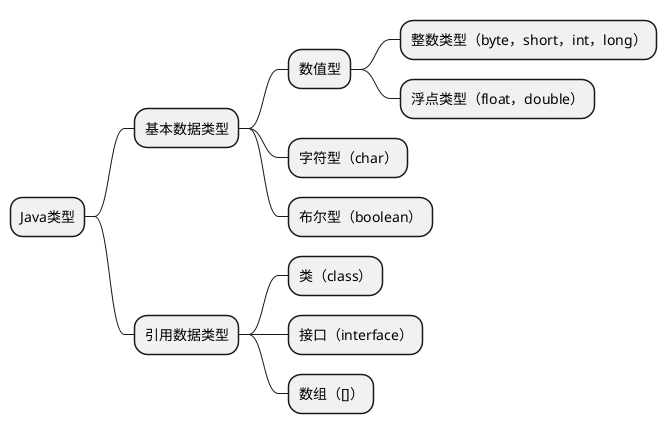

Java 语言是强类型语言，对于每一种数据都定义了明确的具体的数据类型，在内存中分配了不同大小的内存空间。

## Table of contents

## Java 基本类型




### Java 基本数据类型

| 类型   | 类型名称     | 关键字  | 占用内存 | 取值范围              | 作为成员变量的默认值 |
| ------ | ------------ | ------- | -------- | --------------------- | -------------------- |
| 整型   | 字节型       | byte    | 1 字节   | -128(-2^7)~127(2^7-1) | 0                    |
|        | 短整型       | short   | 2 字节   | -2^15~(2^15-1)        | 0                    |
|        | 整型         | int     | 4 字节   | -2^31~(2^31-1)        | 0                    |
|        | 长整型       | long    | 8 字节   | -2^63~(2^63-1)        | 0L                   |
| 浮点型 | 单精度浮点型 | float   | 4 字节   | -3.403E38~3.403E38    | 0.0F                 |
|        | 双精度浮点型 | double  | 8 字节   | -1.798E308~1.798E308  | 0.0D                 |
| 字符型 | 字符型       | char    | 2 字节   | 表示一个字符'a'..     | '\u0000'             |
| 布尔型 | 布尔型       | boolean | 1 字节   | true 或 false         | false                |

---

## 卷起来 🐎🐲💪

### 直接写 12 的话，Java 会把它当成 int，直接写 3.4 的话，Java 会把它当成 double。

```java
float f = 3.4; //错误
short s = 1;
s = s +1;//错误
s+=1;// 正确，相当于 s1 = (short(s1 + 1);其中有隐含的强制类型转换。
```

### Java 数据类型转换

如果要进行 “窄化转换” 的操作，也就是说将 “ 能容纳更多细节信息的类型 ” 往 “ 不能容纳那么多细节的类型 ” 转换，那么就会面临信息丢失的危险。此时编译器不会帮助我们自动转换，而是需要我们自己承担风险！必须由我们进行显式地类型转换！（就例如：float 类型转 int 类型）

然而如果我们进行扩展转换，就像 int 转为 float，那么就没必要进行显式地类型转换。

### JVM 在运行时创建了一个缓存区域，并创建了一个 Integer 数组。这个数组存储了-128 至 127 的值。

如果 Integer 的值在-128 至 127 之间，则是去缓存里面去获取。因此上面的 i 和 j 指向的是同一个内存地址。因为 128 超过了这个缓存区域，因此第二次赋值的时候重新开辟了两个内存地址。第三次因为使用了 new 关键字，在 java 中，new 关键字会开辟新的内存空间。因此第三次赋值是开辟了新的内存空间，此时即使 i 与 j 都是 127，但是内存地址不同。

这个是 Integer 的性质，跟 int 没关系，注意看 int 类型的 i=j 在值都为 128 时，输出的是 true。

```java

Integer a = new Integer(12);
Integer b = new Integer(12);
System.out.println(a==b);
Integer c = 129;
Integer d = 129;
System.out.println(c == d);
Integer e = 127;
Integer f = 127;
System.out.println(e==f);
```

输出结果是：

```bash
false
false
true
```

### Math.round(11.5) 等于多少？Math.round(-11.5) 等于多少?

Math.round(11.5)的返回值是 12，Math.round(-11.5)的返回值是-11。**四舍五入的原理是在参数上加 0.5 然后进行下取整。**

### switch 是否能作用在 byte 上，是否能作用在 long 上，是否 能作用在 String 上?

在 Java 5 以前，switch(expr)中，expr 只能是 byte、short、char、int。从 Java5 开始，Java 中引入了枚举类型，expr 也可以是 enum 类型，从 Java 7 开始，expr 还可以是字符串（String），但是长整型（long）在目前所有的版 本中都是不可的。

为什么？

网上有很多的答案，个人比较倾向于认为 case 的可能性到 int 就差不多了，因为有 2^31 的范围了。
